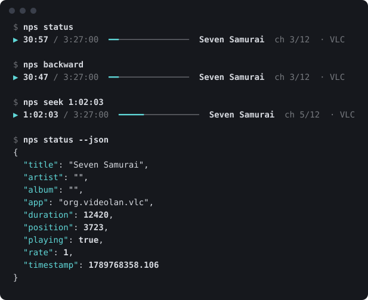

<p align="center"></p>

# nowplayingseek

[](https://github.com/servitola/nowplayingseek/actions/workflows/test.yml) [](https://github.com/servitola/nowplayingseek/releases) [](https://github.com/servitola/homebrew-tap/actions/workflows/tests.yml) [](docs/how-it-works.md) [](LICENSE)

A command-line tool for macOS. It seeks whatever is playing.

Ten seconds back. Ten seconds forward.
From a key, with any app in front: a browser tab, IINA, VLC, Music, Spotify.

macOS has no such key. This is the command behind it.

<p align="center"></p>

## Why

I tune my computer with hotkeys — [my dotfiles](https://github.com/servitola/dotfiles) are mostly that.
I gave the rewind and fast-forward signals a key each. They were no pleasure: no step of my choosing,
and every player took them in its own way. I looked for a tool that would let me do the seeking myself. I tried what
there was; none did.

Then a friend bought a keyboard with a knob and wanted it to wind whatever he was watching.
So I made this. [The longer story](docs/how-it-works.md#why-it-exists).

## Install

```sh
brew install servitola/tap/nowplayingseek
```

One script, also installed as `nps`. No dependencies. It runs on `osascript`, which is already there.

Homebrew 7 wants third-party taps trusted: the full name above trusts this one formula, no more.

## A key

Give `forward` and `backward` a key each. A press is ten seconds.

Hold the key and it moves off in small steps, gathers pace, then settles. Release, and it stops.
A short hold stays short. A long one crosses the film.

Shortcuts.app, [Karabiner-Elements](https://karabiner-elements.pqrs.org/), Hammerspoon, skhd:
[docs/hotkeys.md](docs/hotkeys.md).

## A knob

If you have a mechanical keyboard with a knob, it is a jog wheel.
Turned slowly, it moves by seconds. Flicked, by minutes.

See [the Karabiner-Elements rule](docs/hotkeys.md#a-knob-in-karabiner-elements).

## Commands

| Command | |
| --- | --- |
| `status [--json]` | title, app, position / duration |
| `status --raw` | everything macOS knows about the item, as JSON: chapters, media type, artwork, the file |
| `position`, `duration` | seconds |
| `seek <time>` | to `754`, `12:34` or `1:02:03` |
| `forward [time]`, `backward [time]` | by a step, 10 s unless told otherwise |
| `toggle`, `play`, `pause`, `next`, `previous` | transport |
| `doctor` | exit 0 when Now Playing is readable |

A seek returns when the player has moved, not before.
Exit `0`: done. `1`: nothing is playing. `2`: the player did not listen.

## Limits

- It drives the one app macOS elected as Now Playing, the one in Control Center. To choose
  another, press play there.
- A web page must know how to seek. YouTube does. A page that does not: exit 2.
- It stands on a private API. Apple may close it in any update. Tested on macOS 26.6.

## More

- [Hotkeys, knobs and pedals](docs/hotkeys.md)
- [The curve of a held key, the knob, the config file](docs/advanced.md)
- [For scripts and AI agents](docs/scripting.md)
- [Moving over](docs/migrating.md) from nowplaying-cli, media-control, playerctl, mpc, shpotify
- [Compared with](docs/compared.md) nowplaying-cli, media-control, a player's own keys
- [How it works](docs/how-it-works.md): why a script and not a binary
- [Questions](docs/questions.md)

## Development

`make build`, `make test`, `make test-live` and `make test-world` (VLC and QuickTime, silent),
`make lint`, `make install PREFIX=~/.local`.
Layout, rules and dead ends: [AGENTS.md](AGENTS.md). What is left: [BACKLOG.md](BACKLOG.md).

## Licence

[AGPL-3.0](LICENSE) © [servitola](https://github.com/servitola). For a commercial licence, open an issue.
