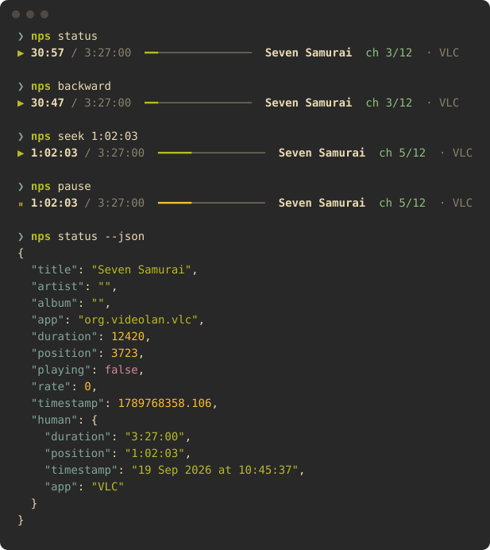

<p align="center"></p>

# nowplayingseek

[](https://github.com/servitola/nowplayingseek/actions/workflows/test.yml) [](https://github.com/servitola/nowplayingseek/releases) [](https://github.com/servitola/homebrew-tap/actions/workflows/tests.yml) [](docs/how-it-works.md) [](LICENSE)

A command-line tool for macOS. It seeks whatever is playing.

Ten seconds back. Ten seconds forward.
From a key, with any app in front: a browser tab, IINA, VLC, Music, Spotify.

macOS has no such key. This is the command behind it.

<p align="center"></p>

## Why

I tune my computer with hotkeys — [my dotfiles](https://github.com/servitola/dotfiles) are mostly that.
I gave the rewind and fast-forward signals a key each. They were no pleasure: no step of my choosing,
and every player took them in its own way. I looked for a tool that would let me do the seeking myself. I tried what
there was; none did.

Then a friend bought a keyboard with a knob and wanted it to wind whatever he was watching.
So I made this. [The longer story](docs/how-it-works.md#why-it-exists).

## Install

```sh
brew install servitola/tap/nowplayingseek
```

It comes through [Homebrew](https://brew.sh); if `brew` is not on this Mac yet, the one line on its front page puts it there.
One script, also installed as `nps`. No dependencies. It runs on `osascript`, which is already there.

Homebrew 7 wants third-party taps trusted: the full name above trusts this one formula, no more.

## A key

Give `forward` and `backward` a key each. The key goes through an app that binds it; the film winds. Two such apps:

|  |  |
| --- | --- |
| **Shortcuts** — the app every Mac already has, nothing else to install. A press moves by the step you wrote. | **Karabiner-Elements** — free, for those who remap keys. Hold the key: it moves off in small steps, gathers pace, settles. Release, and it stops. |
| [Step by step →](docs/hotkeys.md#a-key-in-shortcuts) | [The rule to import →](docs/hotkeys.md#a-key-in-karabiner-elements) |

Hammerspoon, skhd, a Stream Deck, a foot pedal: [anything that runs a command](docs/hotkeys.md#other-tools).

## A knob

<table><tr>
<td width="50%"></td>
<td><b>A keyboard with a knob has a jog wheel.</b><br><br>Turned slowly, it moves by seconds. Flicked, by minutes.<br><br><a href="docs/hotkeys.md#a-knob-in-karabiner-elements">The Karabiner-Elements rule →</a></td>
</tr></table>

## Commands

| Command | |
| --- | --- |
| `forward [time]`, `backward [time]` | by a step, 10 s unless told otherwise |
| `status` | title, app, position / duration |
| `watch` | stays: where it is, second by second, and what happens to it |
| `stream` | stays: every change as it happens; JSON lines in a pipe, [for scripts](docs/scripting.md#following-changes) |
| `position`, `duration` | seconds |
| `seek <time>` | to `754`, `12:34` or `1:02:03` |
| `toggle`, `play`, `pause`, `next`, `previous` | transport |
| `doctor` | exit 0 when Now Playing is readable |
| `config`, `config set <setting> <value>` | the settings in effect; [change one](docs/advanced.md#config-file) |
| `--json`, `--minify`, `--raw` | on any of the above: the answer as JSON, as JSON on one line, as the keys macOS itself holds |

Every command answers with where things stand. A seek returns when the player has moved, not before.
Exit `0`: done. `1`: nothing is playing. `2`: the player did not listen.
Every command and flag, the ones for hotkeys included: `nps --help`.

## Limits

- It drives the one app macOS elected as Now Playing, the one in Control Center. To choose
  another, press play there.
- A web page must know how to seek. YouTube does. A page that does not: exit 2.
- It stands on a private API. Apple may close it in any update. Tested on macOS 26.6.

## More

<table>
<tr><td width="180"><a href="docs/hotkeys.md"></a></td><td><b><a href="docs/hotkeys.md">Hotkeys, knobs and pedals</a></b><br>Shortcuts, Karabiner-Elements, Hammerspoon, skhd: a key, a hold, a knob.</td></tr>
<tr><td width="180"><a href="docs/advanced.md"></a></td><td><b><a href="docs/advanced.md">The curve, the knob, the config file</a></b><br>How a held key gathers pace, and every number that can be changed.</td></tr>
<tr><td width="180"><a href="docs/scripting.md"></a></td><td><b><a href="docs/scripting.md">For scripts and AI agents</a></b><br>One line in, JSON out, and an exit code that is the truth.</td></tr>
<tr><td width="180"><a href="docs/migrating.md"></a></td><td><b><a href="docs/migrating.md">Moving over</a></b><br>From nowplaying-cli, media-control, playerctl, mpc, shpotify: the same words work.</td></tr>
<tr><td width="180"><a href="docs/compared.md"></a></td><td><b><a href="docs/compared.md">Compared with</a></b><br>nowplaying-cli, media-control, a player's own keys.</td></tr>
<tr><td width="180"><a href="docs/how-it-works.md"></a></td><td><b><a href="docs/how-it-works.md">How it works</a></b><br>Why it is a script and not a binary, and why it exists.</td></tr>
<tr><td width="180"><a href="docs/questions.md"></a></td><td><b><a href="docs/questions.md">Questions</a></b><br>The ones people type into a search box.</td></tr>
<tr><td width="180"><a href="docs/development.md"></a></td><td><b><a href="docs/development.md">Development</a></b><br>Build, test, lint; what is left.</td></tr>
</table>

## Licence

[AGPL-3.0](LICENSE) © [servitola](https://github.com/servitola). For a commercial licence, open an issue.
